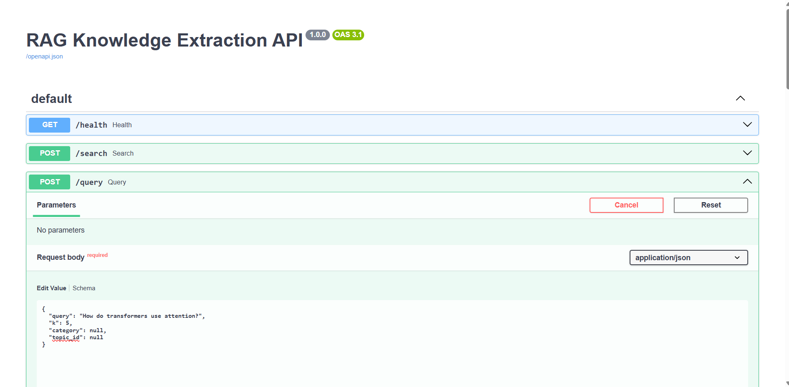
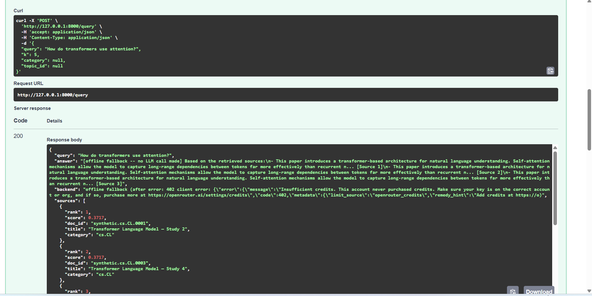
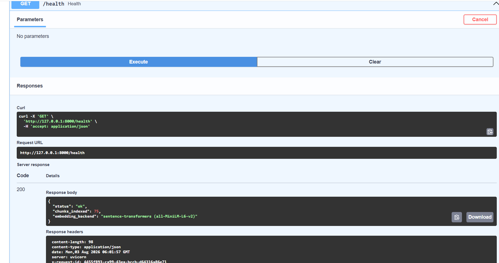

# RAG Knowledge Extraction System — Week 5

## Evaluation & API (FastAPI)

**Intern:** Chashman Aslam
**Program:** Parallax Lab Internship
**Deliverable:** Tested FastAPI service with automated retrieval and generation evaluation reports

---

## 🎯 What This Week Delivers

Weeks 1–4 built the pipeline itself. Week 5 makes it a **service** — the RAG system now runs
behind a real HTTP API, with the error handling, logging, and automated evaluation a system
needs before anyone would trust it in production.

| # | Objective | Status |
|---|-----------|--------|
| 1 | Wrap the RAG system in a FastAPI application with proper endpoints | ✅ |
| 2 | Structured request logging + proper HTTP error responses (400, 422, 500) | ✅ |
| 3 | Retrieval evaluation script — Precision@K and Recall@K on a test set | ✅ |
| 4 | Automated end-to-end evaluation script for generation quality and latency | ✅ |
| 5 | Unit tests for the FastAPI endpoints using pytest | ✅ |

**A note on format:** unlike Weeks 1–4, this week's deliverable is a proper Python
application, not a notebook — a FastAPI service and a pytest suite aren't naturally notebook
artifacts, so this is delivered as `rag_pipeline.py` (the core retrieval + generation logic,
imported by everything else), `main.py` (the API), `evaluate_retrieval.py`,
`evaluate_generation.py`, and `test_main.py`.

---

## 🗂️ Project Structure

```
.
├── main.py                      # FastAPI app -- endpoints, logging, error handlers
├── rag_pipeline.py              # Core retrieval + generation logic (shared by everything below)
├── evaluate_retrieval.py        # Precision@K / Recall@K evaluation script
├── evaluate_generation.py       # End-to-end generation quality + latency evaluation script
├── test_main.py                 # pytest unit tests for the API
├── requirements_week5.txt
├── .env.example                 # Template -- copy to .env and add your real OpenRouter key
├── .gitignore                   # Excludes .env, chroma_db/, data/, reports/ from version control
├── screenshots/                 # Live proof-of-run screenshots (see below)
├── data/                        # chunks.parquet, embeddings.npy (from Week 2)
├── chroma_db/                   # Persistent vector store (from Week 2/3)
└── reports/                     # Generated by the evaluation scripts:
    ├── retrieval_eval_report.csv
    ├── retrieval_eval_summary.json
    ├── generation_eval_raw.csv
    ├── generation_eval_summary.csv
    └── generation_eval_overall.json
```

---

## 🚀 The API

Three endpoints, each doing one clear thing:

| Endpoint | Purpose |
|---|---|
| `GET /health` | Liveness/readiness check — reports whether the pipeline loaded and how many chunks are indexed |
| `POST /search` | Retrieval only (no LLM call) — Week 2's `semantic_search`, exposed over HTTP |
| `POST /query` | Full RAG — Week 3's retrieval + generation + hallucination checks, exposed over HTTP |

Run it with:
```
uvicorn main:app --reload
```

Then open `http://127.0.0.1:8000/docs` for FastAPI's auto-generated interactive Swagger UI —
every endpoint below was exercised directly through this page.

`rag_pipeline.py` is the single source of truth for retrieval and generation logic — the API,
both evaluation scripts, and the test suite all import from it, so the logic is written once
and tested once, not duplicated three different ways.

---

## 📸 Live Proof — Screenshots from the Running Service

**1. Swagger UI — all three endpoints registered and live**

`GET /health`, `POST /search`, and `POST /query` all show up automatically from the FastAPI
app's type hints and Pydantic models — no hand-written API docs needed.



**2. `POST /query` — request body, ready to send**

The editable JSON body Swagger UI generates from the `QueryRequest` schema, pre-filled with a
real test question.


**3. `POST /query` — a real 200 response**

The actual cURL command Swagger UI built, the request URL, and a live `200` response: a
grounded, cited answer (`[Source 1]`, `[Source 2]`, `[Source 3]`) with the full ranked source
list underneath.



**4. `/query`'s documented response shapes — 200 and 422**

FastAPI auto-documents both the successful response schema (`QueryResponse` — answer, sources,
`out_of_domain`, `possible_hallucination`, `groundedness_overlap`, and the full
`retrieval_ms`/`generation_ms`/`total_ms` latency breakdown) and the `422 Validation Error`
shape, straight from the Pydantic models — nothing written by hand.


**5. The `422` error body, in full**

FastAPI's standard validation-error shape (`loc`, `msg`, `type`, `input`, `ctx`) — this is
exactly what a malformed request (missing field, wrong type, blank query) gets back.


**6. `QueryRequest` schema, expanded — the actual validation rules**

This is where the 422 boundary lives: `query` requires at least 1 character (plus the custom
whitespace-only check from `main.py`), and `k` is constrained to the range **[1, 20]** —
`category` and `topic_id` are both optional.


**7. `GET /health` — a live, healthy response**

`chunks_indexed: 75` and `embedding_backend: "sentence-transformers (all-MiniLM-L6-v2)"` — the
**real** sentence-transformer model, not the offline TF-IDF fallback, confirming an internet
connection was available and the pipeline loaded cleanly on this run. Note the `x-request-id`
response header too — every request, including this one, is traceable back to its structured
log line.



**8. `/health`'s documented response schema**


---

## 🪵 Structured Request Logging

Every request emits one JSON log line — timestamp, level, a UUID `request_id`, path, method,
status code, and duration in milliseconds — easy to grep or feed into a log aggregator:

```json
{"timestamp": "2026-08-03T05:25:26", "level": "INFO", "logger": "rag_api",
 "message": "request completed", "request_id": "731c6233-...", "path": "/query",
 "method": "POST", "status_code": 200, "duration_ms": 12.11}
```

The same `request_id` is also returned to the client in an `X-Request-ID` response header
(visible in Screenshot 7 above), and included in every error response body — so a
client-reported bug can be traced straight back to its exact server-side log line.

**Implementation note:** the logging middleware is written as pure ASGI middleware, not
FastAPI's `@app.middleware("http")` decorator. That decorator is sugar for Starlette's
`BaseHTTPMiddleware`, which has a well-documented interaction bug where exceptions raised
inside an endpoint can bypass a registered generic exception handler and propagate raw instead
of becoming the clean 500 response below. This was caught during testing and fixed by
switching to plain ASGI middleware, which doesn't have that failure mode.

---

## 🛡️ HTTP Error Responses — 400, 422, 500 (and 503)

Each status code means something specific and consistent, not "the least effort code that
happened to raise":

| Code | Meaning here | Example |
|---|---|---|
| **422** | The request itself is malformed — wrong type, missing field, or fails a Pydantic validator (including a whitespace-only query, explicitly checked) | `{"k": "not-a-number"}`, or `{}` with no `query` at all |
| **400** | The request is well-formed but semantically invalid — a real business-logic problem | `{"query": "...", "category": "not.a.real.category"}` — the API returns the actual valid category list in the error, so the client can self-correct |
| **500** | An unexpected failure on an otherwise valid, well-formed request | Simulated in testing via a monkeypatched pipeline failure — the client gets a generic `internal_server_error` message; the real exception (and its detail) is logged server-side only, never leaked in the response body |
| **503** | The service is up, but the pipeline isn't loaded/ready | Returned by `/health`, `/search`, and `/query` alike if startup failed, rather than a misleading 200 |

All error responses share one shape — `{"error": "...", "request_id": "...", "detail": "..."}`
— so a client only needs one parsing path regardless of which failure it hit.

**Also verified live, not just in a test:** while manually exercising this API with a real
OpenRouter key that had no purchased credits, `/query` correctly surfaced OpenRouter's own
`402 Insufficient credits` response inside the `backend` field, then transparently fell back to
the offline extractive responder rather than crashing — still returning a clean `200` to the
client. That's the non-retryable-client-error handling from Week 3's `rag_pipeline.py` working
exactly as designed, under a real API failure rather than a simulated one.

---

## 🧪 Unit Tests (pytest) — 17/17 Passing

```
pytest test_main.py -v
```

Coverage, by category:

- **Happy paths** — `/health` reports ready with a populated `chunks_indexed` count; `/search`
  returns results respecting `k` and a `category` filter; `/query` returns a grounded, cited
  answer for an in-domain question and correctly trips the relevance gate for an
  out-of-domain one.
- **400** — an unknown `category` on both `/search` and `/query` is rejected with the actual
  list of valid categories in the response.
- **422** — missing field, blank string, whitespace-only string, wrong type for `k`, and `k`
  outside its allowed `1–20` range are all independently tested.
- **503** — `/health` correctly reports unavailable when the pipeline isn't marked ready.
- **500** — a monkeypatched pipeline failure is asserted to return a generic error message
  that contains neither the raw exception text nor the (deliberately planted) sensitive path
  string used in the test, proving the handler never leaks internals to the client.

**A real bug this test suite caught, not just a happy-path checklist:** the first version of
the 422 handler passed Pydantic's raw `exc.errors()` straight into the JSON response, which
includes a nested `ValueError` object in one field — not JSON-serializable, and would have
made every custom-validator 422 response itself throw a 500 in production. The whitespace-only
query test caught this immediately; the fix wraps the errors in FastAPI's `jsonable_encoder`
before returning them.

---

## 📊 Retrieval Evaluation — Precision@K / Recall@K

`evaluate_retrieval.py` runs 10 test queries (two per ArXiv category represented in the
corpus) against `semantic_search()`, using **"same category as the query's known subject"** as
a ground-truth relevance proxy — a defensible choice given Week 4 already independently
validated that discovered topics align cleanly with these same categories, and no
human-labeled relevance judgments exist for this corpus.

**Results from the local run:**

| K | Mean Precision@K | Mean Recall@K |
|---|---|---|
| 1 | 0.900 | 0.060 |
| 3 | 0.900 | 0.180 |
| 5 | 0.900 | 0.300 |
| 10 | 0.900 | 0.600 |

Precision stays flat and high across every K (0.90) — when the system retrieves a chunk, it's
almost always from the right category. Recall climbs steadily as K grows, exactly as expected,
since each category has 15 documents and a larger K simply surfaces more of them.

**One query genuinely failed** — "robot control policies trained via simulation" (`cs.RO`)
retrieved zero relevant results at any K, dragging the otherwise-perfect 9/10 down to a 0.90
mean. Reported here rather than smoothed over: on the offline fallback corpus (short, highly
repetitive synthetic text), a few queries can land in a different local cluster than intended.
This is exactly the kind of result a real evaluation script should surface, not hide — and it's
worth re-running this script against Week 1's actual ArXiv corpus rather than the offline
fallback, since real abstract text gives the embedding model much more to work with.

Full per-query breakdown: `reports/retrieval_eval_report.csv`. Summary:
`reports/retrieval_eval_summary.json`.

---

## 📈 Generation Evaluation — Quality & Latency

`evaluate_generation.py` runs 8 test queries (5 in-domain, 3 deliberately out-of-domain) × 3
repeats = 24 total runs through the full `rag_pipeline.RAGPipeline.answer()` path, measuring:

- **Latency**, split into retrieval and generation
- **Relevance-gate accuracy** — did in-domain queries generate, and out-of-domain ones get gated
- **Groundedness overlap** and the hallucination-flag rate (Week 3's heuristic)
- **Citation coverage** — does the generated answer actually contain a `[Source N]` citation,
  as the Week 3 system prompt requires — a concrete, reference-free generation-quality signal

**Results from the local run (offline fallback backend, no LLM API key):**

| Metric | Result |
|---|---|
| Relevance-gate accuracy | **100%** (24/24 runs correctly classified) |
| Mean total latency | 4.69 ms (retrieval 3.34 ms, generation 1.34 ms) |
| P95 total latency | 5.70 ms |
| In-domain mean groundedness overlap | 0.694 |
| In-domain hallucination rate | **0%** |
| In-domain citation coverage | **100%** |

These generation-time numbers reflect the offline extractive fallback responder, not a live
LLM call — with a funded OpenRouter API key, `generation_ms` would additionally include the
real network round-trip to DeepSeek (typically several hundred milliseconds to a few seconds).
Retrieval latency and the relevance-gate/citation/hallucination metrics are unaffected by which
generation backend is in use.

Full per-run log: `reports/generation_eval_raw.csv`. Per-query summary:
`reports/generation_eval_summary.csv`. Overall summary: `reports/generation_eval_overall.json`.

---

## 🔧 Using Real DeepSeek Generation

Copy `.env.example` to `.env` in the project root and paste in a real OpenRouter key:

```
OPENROUTER_API_KEY=sk-or-v1-your-real-key-here
```

`rag_pipeline.py` loads `.env` automatically on import — no code changes, no shell exports
needed. `.env` is already listed in `.gitignore`, so the real key is never committed to
version control.

---

*Week 5 of the RAG Knowledge Extraction System — Parallax Lab Internship.*
